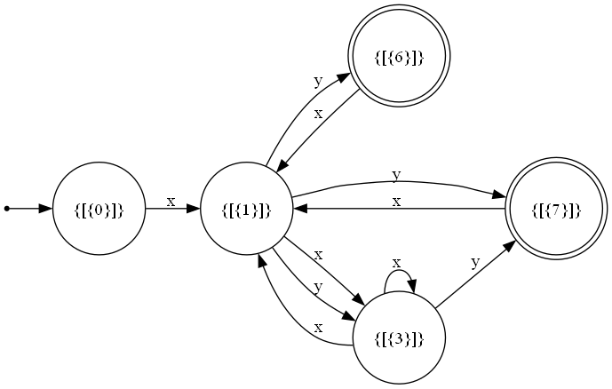

# Buchi Automaton Synthesis from Regular Expressions

## Overview
This repository contains code for synthesizing a **Buchi Automaton** from a given regular expression. The supported operations include:

- `*` (Kleene star) – for repetition
- `|` (Disjunction) – for alternative choices
- **Implicit concatenation** – for committed conjunction (e.g., `ab` means `a` followed by `b`)
- `()` (Parentheses) – for operation prioritization
- `^` (ω-iteration) - for infinite repetition


The implemented algorithm parses the regular expressions for **regular language** and **ω-regular language**, constructs equivalent automata and concatenate them to get the Buchi Automaton.

## Features
- **Recursive parsing** of regular expressions
- **Conversion to a Buchi Automaton** with a state-transition representation
- **Graph visualization support** provided by https://github.com/d1mmm

### Example Regex Conversions
#### #1 Regular language: `(x(x)*y)`, ω-regular language: `(xy)^`
```
Input Alphabet: x y
Output Alphabet:
Initial states: [{0}]
Final States: [{6}] [{7}]
States: [{0}] [{1}] [{3}] [{6}] [{7}] [{3}] [{1}]
Transitions:
    [{0}] -- x --> [{1}]
    [{1}] -- y --> [{7}]
    [{1}] -- x --> [{3}]
    [{3}] -- x --> [{1}]
    [{3}] -- y --> [{7}]
    [{3}] -- x --> [{3}]
    [{7}] -- x --> [{1}]
    [{6}] -- x --> [{1}]
    [{1}] -- y --> [{6}], [{3}]
```



#### #2 Regular language: `x|y`, ω-regular language: `y(x)^`
```
Input Alphabet: x y
Output Alphabet:
Initial states: [{4}]
Final States: [{3}]
States: [{1}] [{3}] [{3}] [{4}] [{1}]
Transitions:
    [{1}] -- y --> [{3}], [{1}]
    [{4}] -- x --> [{1}]
    [{1}] -- x --> [{3}]
    [{4}] -- y --> [{1}], [{3}]
    [{3}] -- x --> [{3}]
```


#### #3 Regular language: `a(b|c)`, ω-regular language: `(c|d)a^`
```
Input Alphabet: a b c d
Output Alphabet:
Initial states: [{0}]
Final States: [{7}]
States: [{7}] [{3}] [{1}] [{0}] [{1}] [{3}] [{5}]
Transitions:
    [{0}] -- a --> [{1}]
    [{1}] -- b --> [{3}]
    [{3}] -- d --> [{7}], [{3}]
    [{1}] -- c --> [{3}], [{5}]
    [{3}] -- c --> [{7}], [{1}]
    [{7}] -- a --> [{7}]
    [{3}] -- a --> [{7}]
    [{1}] -- a --> [{7}]
```


#### #4 Regular language: `xy`, ω-regular language: `z^`
```
Input Alphabet: x y z
Output Alphabet:
Initial states: [{0}]
Final States: [{4}] [{3}]
States: [{4}] [{1}] [{3}] [{0}] [{1}]
Transitions:
    [{3}] -- z --> [{1}], [{4}]
    [{0}] -- x --> [{1}]
    [{1}] -- y --> [{3}]
    [{4}] -- z --> [{1}], [{4}]
    [{1}] -- z --> [{4}], [{1}]
```
