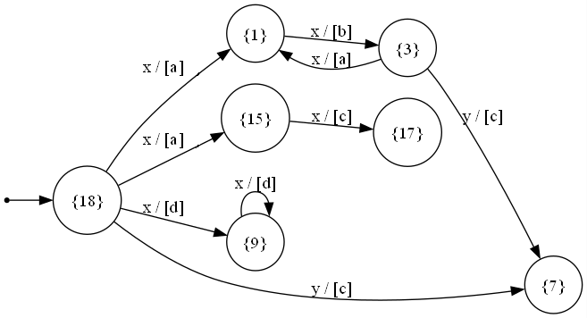
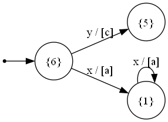

# Mealy Automaton Synthesis from Regular Expressions

## Overview
This repository contains code for synthesizing a **Mealy Automaton** from a given regular expression. The supported operations include:

- `*` (Kleene star) – for repetition
- `|` (Disjunction) – for alternative choices
- **Implicit concatenation** – for committed conjunction (e.g., `ab` means `a` followed by `b`)
- `()` (Parentheses) – for operation prioritization
- `[x/a]` means input `x` produces output `a`.

The implemented algorithm parses the regular expression and constructs an equivalent Mealy Automaton using **epsilon transitions** where necessary and then removes them.

## Features
- **Recursive parsing** of regular expressions
- **Conversion to a Mealy Automaton** with a state-transition representation
- **Epsilon transitions handling**
- **Graph visualization support** provided by https://github.com/d1mmm

### Example Regex Conversions
#### #1 Regex: `([x/a][x/b])*[y/c]|[x/d]*|[x/a][x/c]`
```
Input Alphabet: x y
Output Alphabet: a b c d
Initial State: 18
Final States: 17 9 18 7
States: 1 3 17 15 9 18 7
Transitions:
    18 -- x / [a, a, d] --> 1, 15, 9
    3 -- y / [c] --> 7
    9 -- x / [d] --> 9
    1 -- x / [b] --> 3
    3 -- x / [a] --> 1
    18 -- y / [c] --> 7
    15 -- x / [c] --> 17
```



#### #2 Regex: `([x/a])*|[y/c]`
```
Input Alphabet: x y
Output Alphabet: a c
Initial State: 6
Final States: 1 5 6
States: 1 5 6
Transitions:
    6 -- y / [c] --> 5
    1 -- x / [a] --> 1
    6 -- x / [a] --> 1
```
