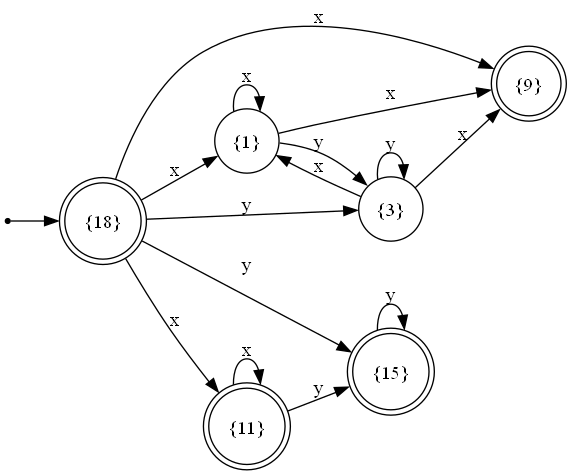

# NFA Synthesis from Regular Expressions

## Overview
This repository contains code for synthesizing a **non-deterministic finite automaton (NFA)** from a given regular expression. The supported operations include:

- `*` (Kleene star) – for repetition
- `|` (Disjunction) – for alternative choices
- **Implicit concatenation** – for committed conjunction (e.g., `ab` means `a` followed by `b`)
- `()` (Parentheses) – for operation prioritization

The implemented algorithm parses the regular expression and constructs an equivalent NFA using **epsilon transitions** where necessary and then removes them.

## Features
- **Recursive parsing** of regular expressions
- **Conversion to an NFA** with a state-transition representation
- **Epsilon transitions handling**
- **Graph visualization support**

### Example Regex Conversions
#### #1 Regex: `(x|y)*x|x*y*`
```
Alphabet: x y
Initial State: 18
Final States: 9 15 11 18
States: 9 15 11 18 1 3
Transitions:
    1 --x--> 9 1
    3 --y--> 3
    3 --x--> 9 1
    1 --y--> 3
    18 --x--> 9 11 1
    11 --x--> 11
    15 --y--> 15
    11 --y--> 15
    18 --y--> 15 3
```



#### #2 Regex: `((0)*1)*`
```
Alphabet: 0 1
Initial State: 6
Final States: 6 5
States: 6 1 5
Transitions:
    1 --0--> 1
    6 --1--> 5
    1 --1--> 5
    6 --0--> 1
    5 --0--> 1
    5 --1--> 5 
```


#### #3 Regex: `xy*|y|yx|xx`
```
Alphabet: x y
Initial State: 20
Final States: 1 7 13 3 19
States: 11 1 7 13 3 19 17 20
Transitions:
    11 --x--> 13
    20 --y--> 7 11
    1 --y--> 3
    3 --y--> 3
    17 --x--> 19
    20 --x--> 1 17
```

